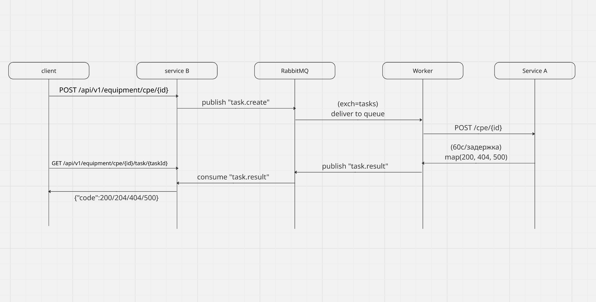

# Тестовое задание от Ростелекома

## Требования

- Python 2.7+ (использовалась 3.14.5)
- RabbitMQ (5672, UI 15672)

## Установка
```bash
python3 -m venv venv
source venv/bin/activate
pip install -r req.txt
```

## Диаграмма взаимодествия


# Запуск (в корне проекта)

## Первый терминал (Сервис А)
```bash
PYTHONPATH=. python -m uvicorn app.service_a.main:app --host 0.0.0.0 --port 8444 --ssl-certfile ./cert.pem --ssl-keyfile ./key.pem
```
## Второй терминал (Сервис В)
```bash
YTHONPATH=. python -m uvicorn app.service_b.main:app --host 0.0.0.0 --port 8443 --ssl-certfile ./cert.pem --ssl-keyfile ./key.pem
```
## Третий сервис (Worker)
```bash
PYTHONPATH=. python -m app.worker.main
```

# Запуск через Docker
```bash
# сборка и запуск всех сервисов + RabbitMQ
docker compose up -d --build

# проверка
docker compose ps
docker compose logs -f service_a
# UI RabbitMQ: http://localhost:15672 (guest/guest)
# остановка
# docker compose down
```

# Быстрые проверки

```bash
#health

curl -k https://localhost:8444/health
curl -k https://localhost:8443/health
```

```bash
# happy path

taskId=$(curl -sk https://localhost:8443/api/v1/equipment/cpe/ABC123 \
  -H 'content-type: application/json' \
  -d '{"timeoutInSeconds":14,"parameters":{"username":"admin","password":"admin","interfaces":[1,2,3]}}' \
  | python3 -c 'import sys,json; print(json.load(sys.stdin)["taskId"])')
  
curl -sk "https://localhost:8443/api/v1/equipment/cpe/ABC123/task/$taskId"
# {"code":204,...}
# через 60 сек:
curl -sk "https://localhost:8443/api/v1/equipment/cpe/ABC123/task/$taskId"
# {"code":200,"message":"Completed"}
```

```bash
# Errors

# 404
t404=$(curl -sk https://localhost:8443/api/v1/equipment/cpe/DEV404 \
  -H 'content-type: application/json' \
  -d '{"timeoutInSeconds":5,"parameters":{"username":"u","password":"p","interfaces":[1]}}' \
  | python3 -c 'import sys,json; print(json.load(sys.stdin)["taskId"])')
curl -sk "https://localhost:8443/api/v1/equipment/cpe/DEV404/task/$t404"    
 # {"code":404,...}

# 500 + ретраи
t500=$(curl -sk https://localhost:8443/api/v1/equipment/cpe/DEV500 \
  -H 'content-type: application/json' \
  -d '{"timeoutInSeconds":5,"parameters":{"username":"u","password":"p","interfaces":[1]}}' \
  | python3 -c 'import sys,json; print(json.load(sys.stdin)["taskId"])')
curl -sk "https://localhost:8443/api/v1/equipment/cpe/DEV500/task/$t500"     
# {"code":500,...}
```

# Запуск интеграционного теста
```bash
pytest -q
```

